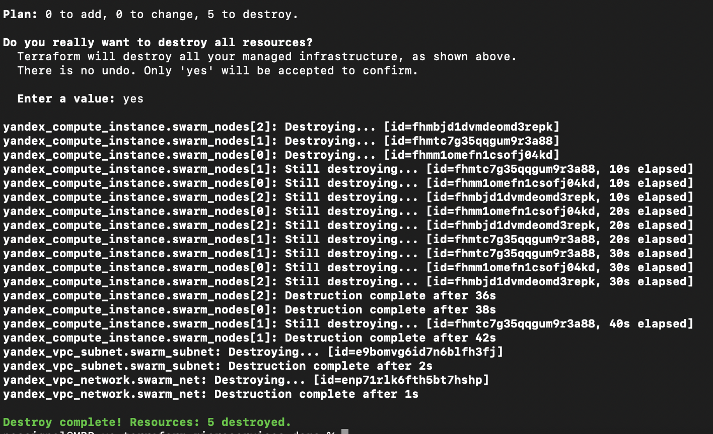

# Yandex.Cloud Microservices Demo (Docker Swarm)

## 📎 Оригинальный проект

Этот проект основан на [microservices-demo](https://github.com/GoogleCloudPlatform/microservices-demo) от Google.
Оригинальная версия предназначена для запуска в Kubernetes.  
Текущая реализация адаптирована для запуска в Docker Swarm и развёртывания в Yandex Cloud.

## Описание
Развёртывание микросервисного приложения в Yandex.Cloud с использованием:
- Terraform (инфраструктура)
- Docker Swarm (оркестрация)
- Yandex.Cloud (облако)

## Что сделано
- Созданы 3 ВМ в одной VPC через Terraform
- Настроен Docker Swarm (1 manager, 2 workers)
- Развёрнуты сервисы из microservices-demo
- Настроен overlay network
- Масштабирован frontend
- Проект успешно работает в браузере по внешнему IP

## Скриншоты




## Команды для запуска
См. [terraform/README.md](terraform/README.md) и [docker/README.md](docker/README.md)

## Завершение
```bash
terraform destroy
